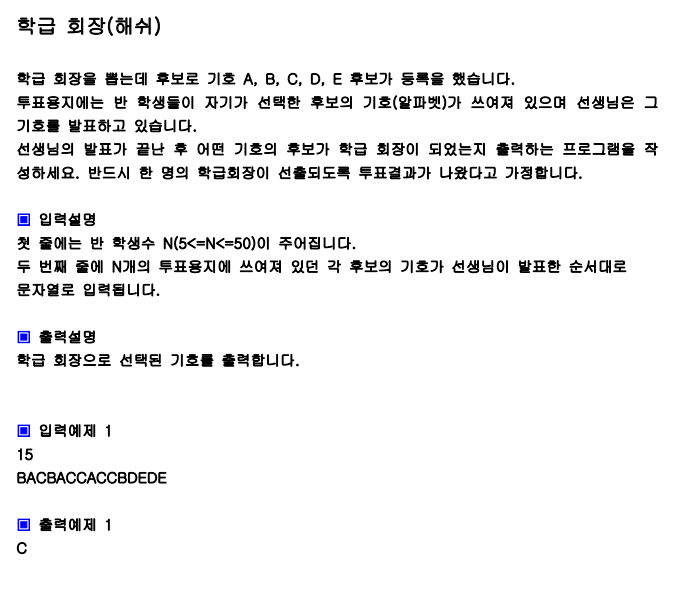
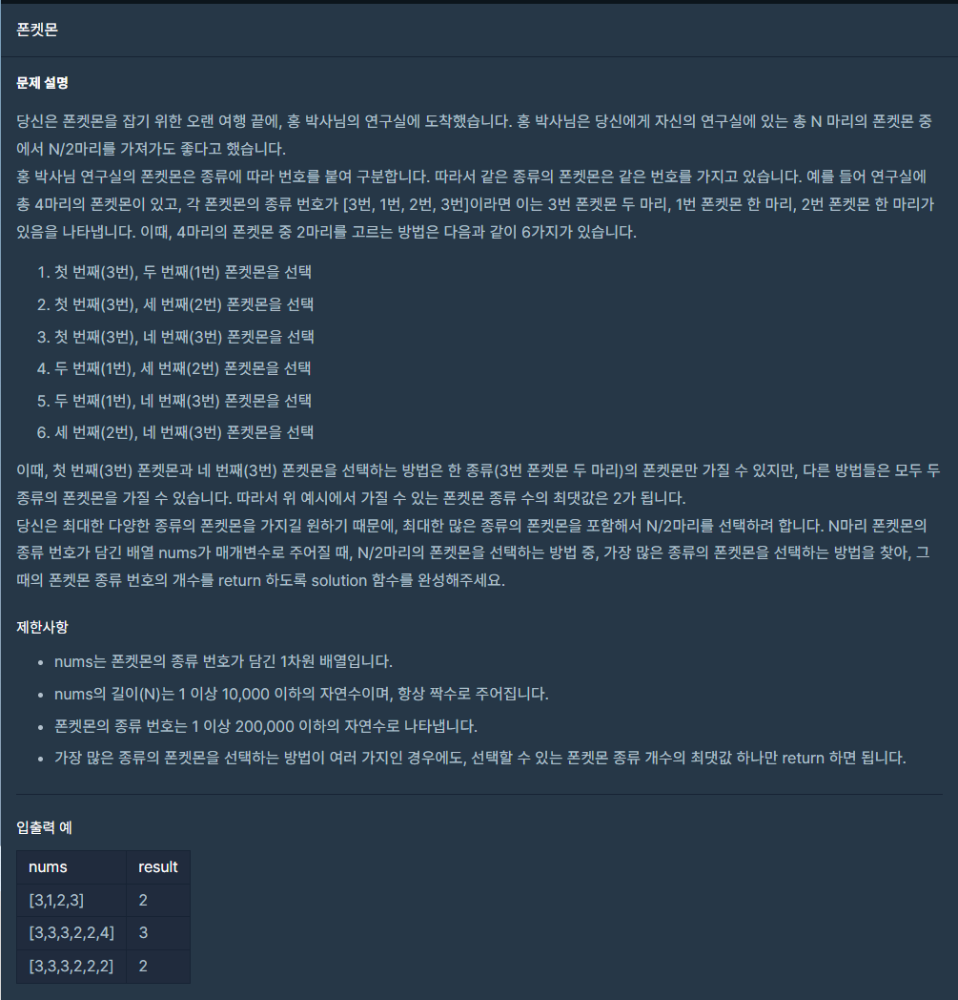
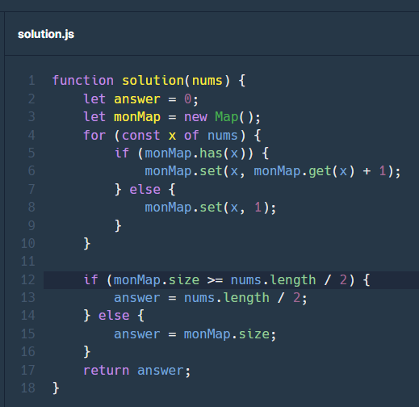

# 해시

## 해시 테이블
* 해시 테이블이란 **Key와 Value로 데이터를 저장하는 자료구조**이다. 해시 테이블을 통해 빠르게 데이터를 검색할 수 있다.
* 기존 자바스크립트에서는 `Object` 자료형으로 해시 테이블을 구현할 수 있었으나, ES6에서 등장한 `Map` 자료형으로도 해시 테이블을 구현할 수 있다.

## JavaScript에서 해시 테이블을 구현하는 방법
1. Array
    * 자바스크립트에서 `Array`의 type도 `Object`이기 때문에 구현은 가능하지만 좋은 방법은 아니다.

2. Object
    * 비교적 간단하다.

3. Map
    * `Map` 자료형은 객체와 다르게 모든 타입을 키로 사용할 수 있다.
    * `Map` 자료형은 탐색, 삽입, 삭제에 대하여 편리한 메서드를 제공한다.
    * `Map` 자료형은 이터러블하다. -> 스프레드 문법 사용이 가능하다.


## Object vs Map
|특징|객체|Map|
|:-----:|:---:|:---:|
|키로 사용할 수 있는 값|문자열 또는 Symbol 값|객체를 포함한 모든 값|
|이터러블|X|O|
|요소 개수 확인|`Object.keys(obj).length`|`map.size`|

## map 자료형의 특징
1. `Map` 객체의 키는 중복될 수 없다. 추가하면 값이 덮어씌워진다.
2. `Map` 객체는 이터러블이다.
```javascript
let h = new Map();

h.set('A', 1);
h.set('B', 2);
h.set('C', 3);

// Map.prototype.forEach 메서드로 순회가능하다.
// 3개의 인수를 전달받는다. (값, 키, Map 객체 자체)
h.forEach((value, key, map) => console.log(value, key, map));
// 1 'A' Map(3)
// 2 'B' Map(3)
// 3 'C' Map(3)

// Map 객체는 이터러블이므로, for...of 문으로 순회가 가능하다.
```
3. `Map` 객체는 키 타입에 제한이 없다.

## Map의 여러가지 메서드
```javascript
// map 자료형 선언 (map 객체 생성)
let hash = new Map();

// 1. set : map 자료형에 요소 추가, 새로운 요소가 추가된 map 객체 반환
hash.set('A', 1);
// 2. get: 특정 키의 값을 가져오기 (탐색)
hash.get('A'); // 1
// 3. has: map 자료형에 특정 키가 존재하는지 확인, boolean 값을 반환
hash.has('A'); // true
hash.has('B'); // false
// 4. size: map 객체의 요소 개수 확인
hash.size; // getter, 읽기 전용이다.
// 5. delete: map 객체의 요소를 삭제, 삭제 성공 여부에 대한 boolean 값 반환
hash.delete('A');
// 6. clear: map 객체의 요소 일괄 삭제, 항상 undefined 반환
hash.clear();
// Map.prototype.keys, Map.prototype.values, Map.prototype.entries
```

## Map 자료형을 활용한 기본 예제
<div align='center'>

</div>

```javascript
// 문제 풀이
function solution(s){  
    let answer;
    let 후보 = new Map();

    for (const x of s) {
        if (후보.has(x)) {
            후보.set(x, 후보.get(x) + 1);
        } else {
            후보.set(x, 1);
        }
    }

    let max = Number.MIN_SAFE_INTEGER;

    // map 자료형은 iterable 입니다.
    for (let [key, val] of 후보) {
        if (val > max) {
            max = val;
            answer = key;
        }
    }
    return answer;
}

let str="BACBACCACCBDEDE";
console.log(solution(str));
```
<hr />

<div align='center'>

</div>

<div align='center'>

</div>

<hr>

## 생각해보기
### 해시 자료구조는 언제 사용하는 것이 좋을까요?

* ### 예시 - 학생부 만들기
1. 배열
    * 학생부에서 학생을 탐색할 때 index를 모르는 경우 `O(n)`의 시간복잡도가 소요된다.

2. 해시 테이블
    * 탐색, 삭제, 삽입이 모두 `O(1)`의 시간복잡도로 구현이 가능하다.

* ## **따라서, 빠르게 값을 찾아야하는 경우에 사용하는 것이 좋다!** 